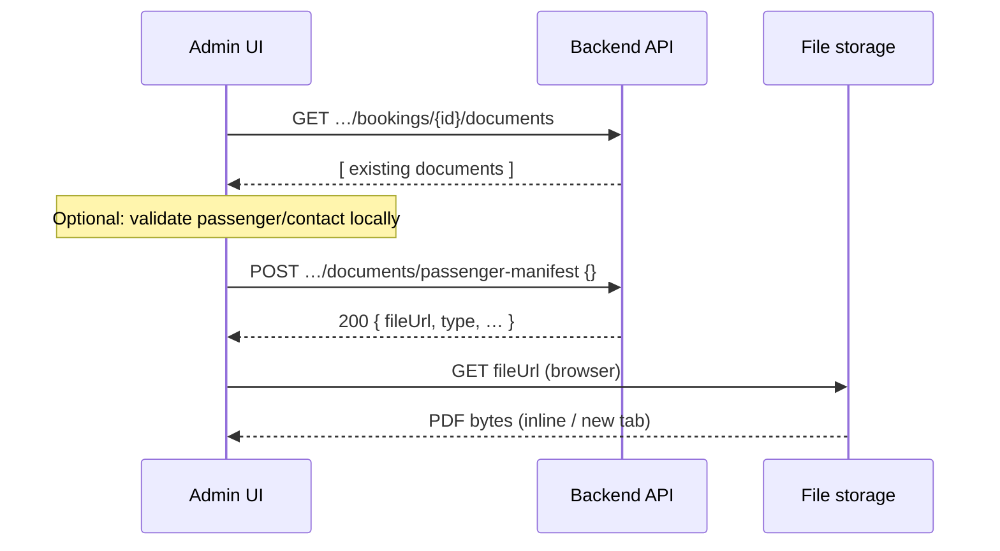

# Booking PDF documents — full guide (backend + frontend alignment)

This document explains **how booking document generation works end-to-end**, what data must exist **before** calling the API, how **backend errors** map to user-visible messages, and why the admin UI might show errors such as incomplete passenger/contact/manifest data — even before or after the HTTP request.

---

## 1. What gets generated

The API generates **three PDF types** for a booking:

| Logical name | URL slug (`POST …/documents/{slug}`) | Stored type (`type` field) |
|--------------|--------------------------------------|-----------------------------|
| Passenger manifest (كشف الركاب) | `passenger-manifest` | `passenger_manifest` |
| Transport contract (عقد النقل) | `contract` | `contract` |
| Payment receipt (إيصال الدفع) | `payment-receipt` | `payment_receipt` |

All successful responses are **JSON** with a **`fileUrl`** pointing to the PDF (browser opens this URL; the response body is **not** raw PDF bytes).

---

## 2. Base URLs and auth

- **API prefix:** `{apiRoot}/api/v1` (e.g. `https://your-api.com/api/v1`).
- **Two equivalent route prefixes** (same behavior):

  - `{apiRoot}/api/v1/bookings/{bookingId}/documents`
  - `{apiRoot}/api/v1/admin/bookings/{bookingId}/documents`

- **Authentication:** `Authorization: Bearer <access_token>` on every call.

---

## 3. HTTP operations

### 3.1 List documents

```http
GET /api/v1/bookings/{bookingId}/documents
```

**Success:** JSON **array** of objects:

| Field | Meaning |
|-------|---------|
| `id` | Document row UUID |
| `bookingId` | Booking UUID |
| `type` | `passenger_manifest` \| `contract` \| `payment_receipt` |
| `fileUrl` | Absolute HTTPS URL to the PDF |
| `issuedAt` | ISO timestamp |

Use this to show “متوفر” / preview links for already-generated files.

---

### 3.2 Generate (or return existing receipt)

```http
POST /api/v1/bookings/{bookingId}/documents/{slug}
Content-Type: application/json

{}
```

`{slug}` must be exactly: `passenger-manifest`, `contract`, or `payment-receipt`.

**Success:** **HTTP 200** + one document object (same shape as list items).

**Body:** Empty JSON `{}` is valid and matches what the backend expects today.

---

## 4. End-to-end flow (recommended UX)



1. Load booking details (including **trip**, **passengers**, **contact**, **rider**).
2. Optionally **GET** list of documents to refresh chips/links.
3. When user taps generate, either **preflight** on the client (your Arabic message) or call **POST** directly and handle HTTP errors.
4. On **200**, open **`fileUrl`** in a new tab or iframe.

---

## 5. Data prerequisites (what must exist in the database)

The backend loads the booking with **`trip`**, **`passengers`**, and **`rider`** (optional for guest-style bookings).

### 5.1 Always required to generate **any** document

| Requirement | Backend behavior if missing |
|-------------|-----------------------------|
| Booking exists | **404** — `Booking not found` |
| User allowed (admin, rider owner, or trip driver) | **403** — `Access denied` |
| **`tripId` resolved** — **this** booking row has `trip_id` set | **400** — explains that the booking has no linked trip (see below) |

Without **`trip_id`** on the booking row, **no** PDF type can be generated — even if “the trip has passengers” elsewhere. Passengers belong to **each booking**; the trip is linked **per booking**.

### 5.1b Troubleshooting: “there are riders on this trip” but generation fails

Usually means **this booking’s `trip_id` is still `NULL`** (demand / unassigned booking), while another booking on the same route/date was assigned. The API only loads `booking.trip` from **`bookings.trip_id`**.

Check in SQL / Prisma Studio for the failing UUID:

```sql
SELECT id, trip_id, rider_id, rider_name, booking_serial
FROM bookings
WHERE id = '<booking-uuid>';
```

If `trip_id` is null, assign a trip to this booking in admin (same flow as “ربط برحلة” / assign trip). After `trip_id` is set, document generation can proceed.

Other **400** messages after a trip exists: incomplete **route**, **driver**, or **car** on that trip (data integrity).

PDF generation in Docker uses system **`chromium`** from the image (`CHROMIUM_PATH=/usr/bin/chromium`) because Puppeteer’s default browser lives under **`~/.cache/puppeteer`**, which is **not** copied when only `node_modules` is copied between Docker stages. **`PUPPETEER_SKIP_CHROMIUM_DOWNLOAD=true`** avoids downloading Chrome during `npm ci`. Puppeteer uses **`domcontentloaded`** so external fonts do not block forever.

### 5.2 Rider / contact identity (for PDF templates)

Templates need a **display name** and **phone** for the customer/contact block. **No rider login or linked account is required.**

The backend fills these from the booking only, in order:

**Name (`fullName`):**

1. Linked rider user `booking.rider.fullName` (if `riderId` is set), else  
2. `booking.riderName`, else  
3. First passenger `passengers[0].fullName`, else  
4. `حجز #{bookingSerial}` (booking serial from the database).

**Phone:**

1. `booking.rider.phone` if rider linked, else  
2. `booking.riderPhone`, else  
3. `booking.contactPhone`, else  
4. First passenger `passengers[0].phone`.

So guest-only bookings work as long as typical booking/passenger data exists; there is **no** separate requirement that `riderName` be stored if another source above provides a label.

> **Frontend:** If your app still blocks generation with a message like *«حجز ضيف بدون اسم … riderName»*, that check is **client-side only** — remove or relax it so it matches this resolution order (or drop the block entirely if product allows PDF with serial-only label).

### 5.3 Passenger manifest (`passenger-manifest`)

- The PDF lists **`booking.passengers`** rows (each row: name, nationality, id, phone in the template).
- The backend does **not** currently enforce `passengers.length === seatCount`. It will generate a PDF even if the array is **empty** (table may be empty or misleading).
- **Recommended frontend rule** (matches typical Arabic copy): before calling generate, ensure:
  - **`seatCount`** (if used) is consistent with the number of **passenger records**, and
  - each required field for your product (e.g. names, IDs) is filled **via** “تعديل الكشف” / passenger edit API.

If your app shows:  
*«لا يمكن توليد المستند: بيانات الراكب أو جهة الاتصال أو كشف الركاب غير مكتملة…»*  
that is almost certainly your **frontend guard** (not a literal English string from this Nest service). Align that guard with sections **5.2** and **5.3** above.

### 5.4 Trip status rules (manifest only)

| Trip status | Rule |
|-------------|------|
| `cancelled` | Cannot generate manifest — **400** |
| `completed` | At most **2** stored `passenger_manifest` documents per booking — **400** if exceeded |
| Not `completed` | At most **5** manifest generations — **400** if exceeded |

### 5.5 Contract (`contract`)

- **One contract per booking.** Second successful generation attempt → **409 Conflict** — `Transport contract has already been issued for this booking`.

### 5.6 Payment receipt (`payment-receipt`)

- **Idempotent:** first call creates a row and PDF; later calls **return the same row** (**200**), no duplicate charge in DB.

---

## 6. Backend error reference (for mapping to Arabic UI)

These are the **English** messages/statuses the API returns (Nest default JSON shape: `statusCode`, `message`, etc.):

| Status | Typical cause |
|--------|----------------|
| **400** | No `trip_id` on booking; incomplete trip route/driver/car; bad slug; manifest limits; cancelled trip |
| **403** | Not admin / not rider / not driver for this booking |
| **404** | Booking id unknown |
| **409** | Contract already exists |
| **500** | PDF render failure, unexpected server error |

Map **`message`** (string or string array) to your localized strings where appropriate.

---

## 7. PDF file URL (`fileUrl`)

- Stored URLs are built using **`PUBLIC_API_URL`** on the server (no trailing slash), e.g.  
  `{PUBLIC_API_URL}/uploads/documents/{filename}.pdf`
- If **`PUBLIC_API_URL`** is wrong in production, the UI will get **200** from the API but the browser **cannot load** the PDF — fix deployment env, not the Angular code path for POST.

---

## 8. Checklist for frontend developers

Before enabling “Generate manifest” / “Generate contract” / “Generate receipt”:

1. **Trip assigned:** `booking.tripId` / trip object present (otherwise backend **400**).
2. **Contact label on PDF:** backend derives name/phone from rider link, **`riderName` / `riderPhone` / `contactPhone`**, or first passenger — **no rider account required**.
3. **Manifest quality:** passenger rows filled per product rules (your **Arabic** validation).
4. **Contract:** hide or disable after first successful contract (expect **409** on retry).
5. **Receipt:** safe to call multiple times; same **`fileUrl`** returned after first creation.

---

## 9. Quick API summary table

| Action | Method | Path |
|--------|--------|------|
| List | `GET` | `/api/v1/bookings/{id}/documents` or `/api/v1/admin/bookings/{id}/documents` |
| Generate | `POST` | `/api/v1/bookings/{id}/documents/passenger-manifest` (or `contract`, `payment-receipt`) |
| Same generate (alias) | `POST` | `/api/v1/admin/bookings/{id}/documents/{slug}` |

---

## 10. Related docs in this repo

- [`BACKEND_BOOKING_DOCUMENTS_API.md`](./BACKEND_BOOKING_DOCUMENTS_API.md) — original contract-oriented spec.

---

*Generated from `DocumentsController` and `DocumentsService` (transport-platform backend).*
